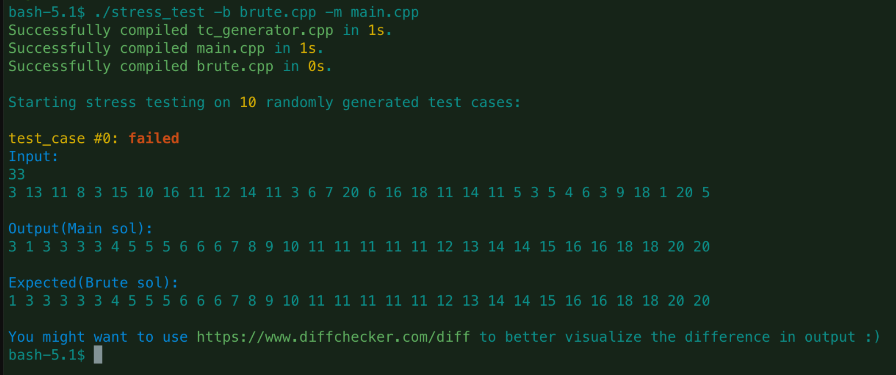

**Note**: A Codeforces blog can be found [here](https://codeforces.com/blog/entry/78985) on `Codeforces`.
# Stress Testing bash script

A simple bash script which stress tests an optimized solution & a brute
force solution on randomly generated testcases, to find a possible failing testcase.<br>

### Usage
Clone this repository using git or download manually.

```bash
# Clone the Repository.
$ git clone https://github.com/bhupixb/Stress-Testing-bash-script

# Change directory.
$ cd Stress-Testing-bash-script

# Give execute permission to `stress_test` script to current user.
$ sudo chmod u+x stress_test

# Assuming your optmized solution is in main.cpp and brute force solution 
# in brute.cpp, to run stress test:
$ ./stress_test -b brute.cpp -m main.cpp

# To print usage, use -h flag
$ ./stress_test -h
```


### When to use:
This is useful when your optimized solution is failing on some test case during a contest<br>
and you are unable to come up with a failing test case. <br> 
In cases like this if you write a brute force solution that you are sure that will produce
correct output and run these 2 solutions on random tests, it can help
you find a test case which fails on your main solution.

### How it works:
1. This script takes your main solution and brute force solution cpp file as argument.
2. Compiles the code & generates executable.
3. Generates testcases(default 10) from `tc_generator.cpp` program and runs your main & brute solution
   against it. Then it checks for difference in output of both solutions, if it differs, the 
   script reports the testcase, output of your main solution and output of your brute force
   solution to your terminal STDOUT.
4. Now you can figure out, what's wrong in your solution given a test case on which your sol
   fails.

### Testcase Generator:
The file `tc_generator.cpp` has some boilerplate code to generate commonly
required testcases like `tree`, `graph`, `array of integers` & `strings`. <br>
You can modify this file to generate test cases as per your requirements.

